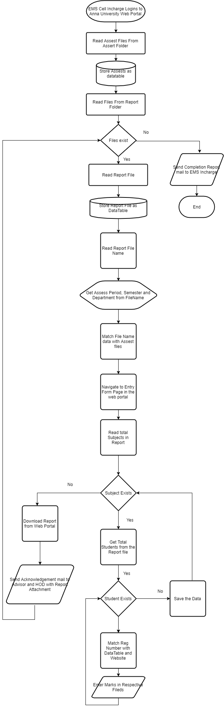

Web Portal Entry Automation
===================

This Robotic Process Automation Project will helps Anna University affiliated Colleges to help the Web portal entry Simpler , Easier and Reduces much human time in entering the Students assessment details manually.   

----------

Requirements
-------------

 1. Shared Folder to Hold Report Documents and Assest Files
 2. Report Generated by Every Class Advisor
 3. File name Should be "[Assessperiod]_ [Semester]_ [Department].xlsx"
 

 **Assests folder contains files for Mapping such as :**

> - Semester Code
> - Subject Code
> - Assessment Period
> - Branch Code
> - Mailing details

---------
Flowchart Diagram : 
-------------

---------
Work Flow : 
-------------               
1. Wait until the EMS incharge login into Web Portal
2. Read all the assests files in the Assest Folder and Generate as DataTables.
3. Read the files in Report folder
    1. Read the File name of the Report       
    2. Read the File name of the Report
    3. Read the file and store as DataTable
    4. Read the Subject code in the file and map with Subject Name
    5. Select the Relevant menus in the Web Portal
    6. Enter the assessment details (i.e. Total Working hours, Present hours, Marks scored) for each students.
4.  Loop the process 3) iv. to 3) vi. for every subjects in the period.
5. Send Status mail to the Respectively Class Advisor and the HODs
6. Loop the Process 3) i. to 5) for Every Files in the Report Folder.
     
----
